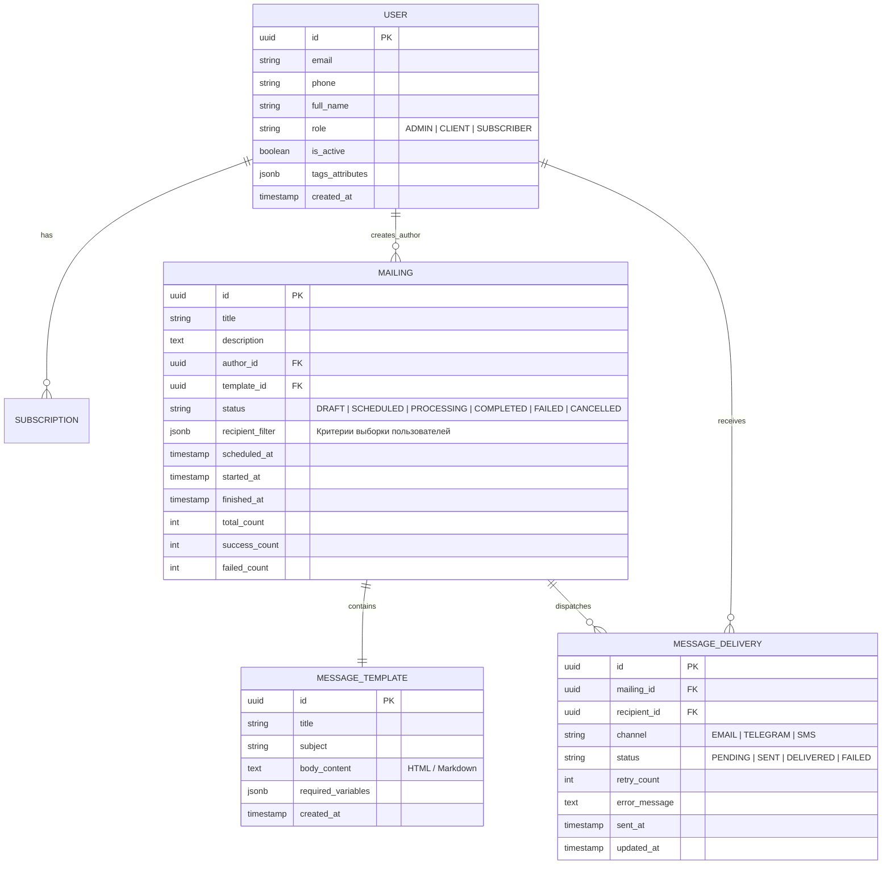
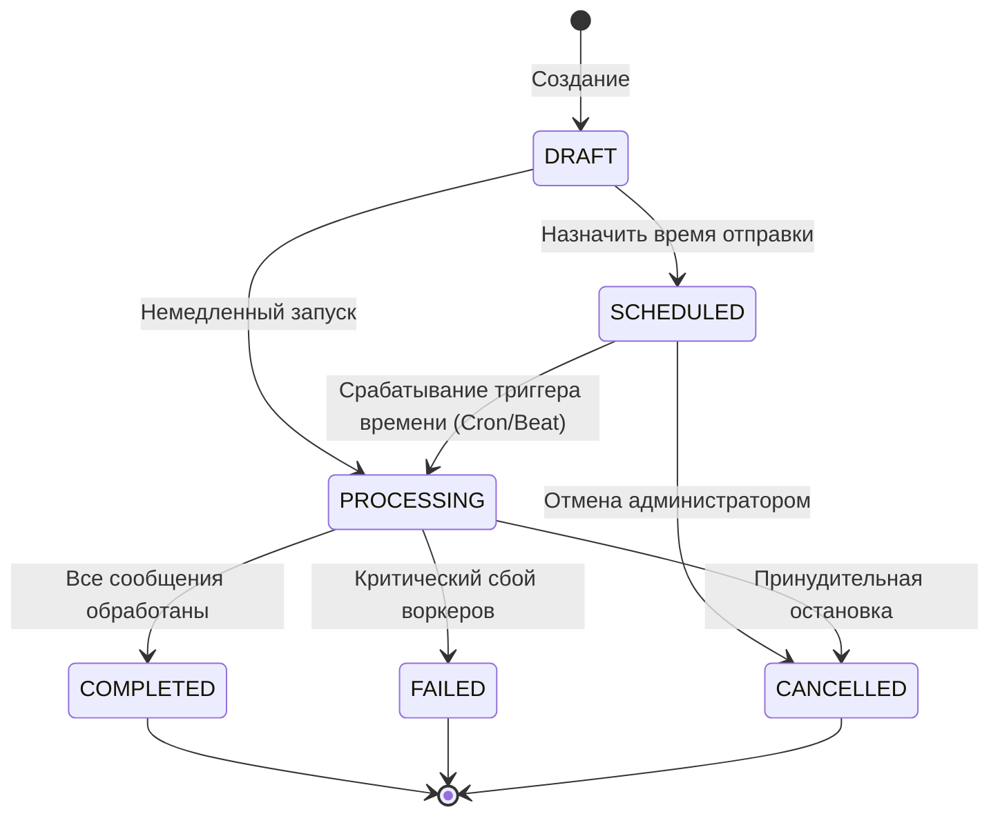
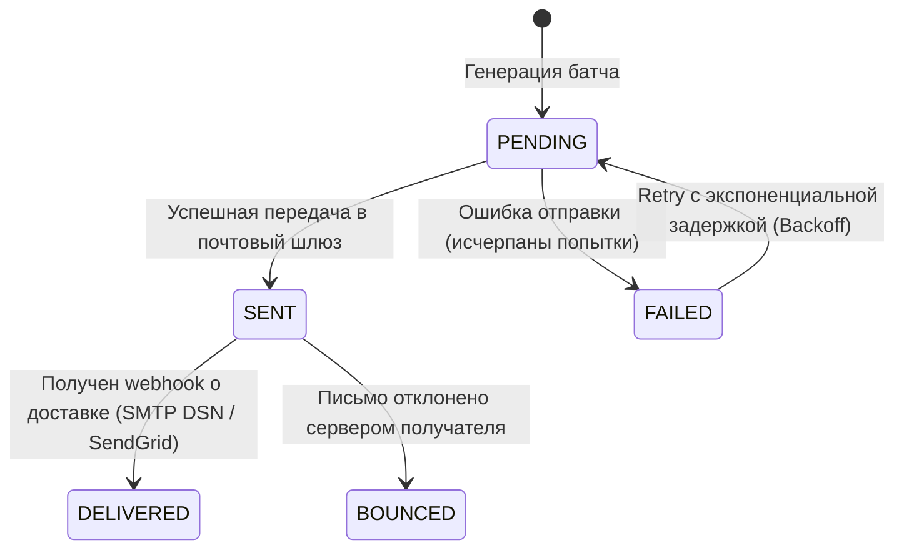
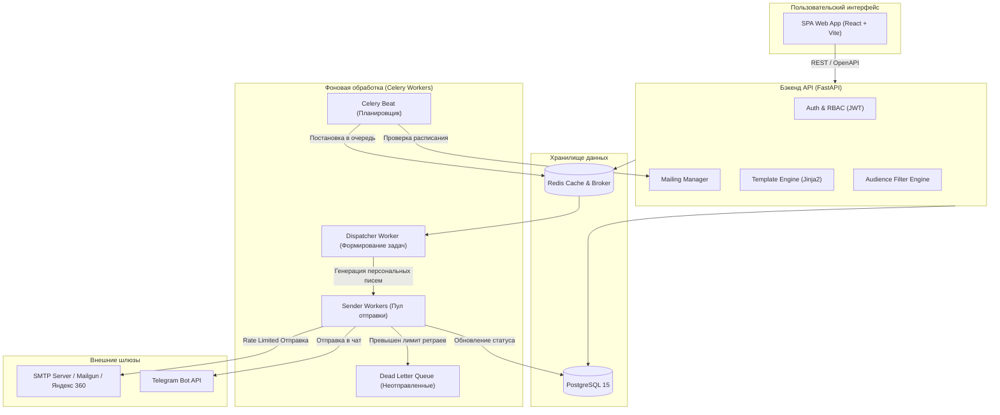
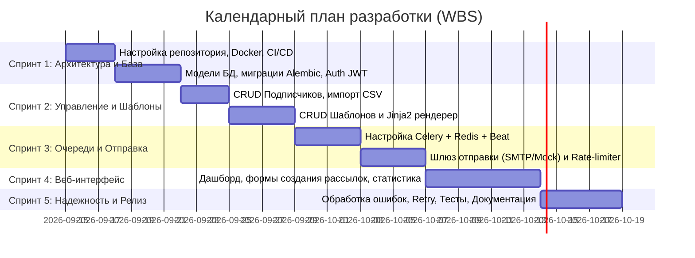

# Архитектурный план проекта: Система управления информационными рассылками (Notification & Mailing Management System)

> **Роль:** CTO & Lead System Architect  
> **Статус документа:** Утверждено к разработке  
> **Версия:** 1.0.0  
> **Цель:** Создание масштабируемой, отказоустойчивой и безопасной системы создания, планирования и отправки массовых информационных рассылок с аналитикой статусов доставки.

---

## 1. Концепция и архитектурное видение (CTO Executive Summary)

### 1.1. Проблематика и назначение
Любая система массовых рассылок сталкивается с тремя ключевыми инженерными вызовами:
1. **Блокировки ввода-вывода (I/O Bottlenecks):** Отправка сообщений через внешние шлюзы (SMTP, SMS, Push, Telegram) занимает от 200 мс до нескольких секунд на адресата. Синхронная отправка в HTTP-потоке недопустима.
2. **Отказоустойчивость и повторные попытки (Retry / Dead Letter):** Внешние провайдеры нестабильны (429 Too Many Requests, сетевые таймауты, лимиты провайдеров). Нужна гарантированная доставка и идемпотентность.
3. **Наблюдаемость статусов:** Бизнес требует знать точный статус каждого отдельного сообщения и всей кампании в реальном времени.

### 1.2. Ключевые архитектурные принципы
- **Асинхронная архитектура на очередях задач (Event-Driven / Worker Pattern).**
- **Идемпотентность отправки:** Повторный вызов задачи не приводит к повторной отправке одного и того же письма пользователю.
- **Разделение контура управления (Admin API/UI) и контура исполнения (Background Workers).**
- **Мультиканальность (на уровне абстракций):** Базовый канал — Email (SMTP/SES/SendGrid), с возможностью добавления Telegram-бота/VK/SMS без изменения бизнес-логики ядра.

---

## 2. Выбор технологического стека (Tech Stack Evaluation & ADR)

### Рекомендуемый промышленный стек (Production & University Ready)

| Уровень | Технология | Обоснование выбора |
| :--- | :--- | :--- |
| **Backend Core** | **Python (FastAPI)** *или* **Django REST Framework** | **FastAPI** гарантирует высокую скорость обработки API-запросов, асинхронный I/O, автоматическую документацию OpenAPI (Swagger) и типизацию (Pydantic). *(Для проектов, где важна готовая админка «из коробки», отличной альтернативой является Django + DRF).* |
| **Очередь задач** | **Celery** / **ARQ** + **Redis** | Стандарт индустрии для асинхронного выполнения тяжелых фоновых задач, пакетной обработки (batching) и отложенного запуска по таймеру (Celery Beat). |
| **Основная СУБД** | **PostgreSQL (15+)** | Реляционная целостность (ACID), надежные транзакции, поддержка JSONB для метаданных провайдеров, высокая производительность индексов. |
| **Кэш / Брокер** | **Redis (7+)** | Хранение сессий, очередей задач, распределенные блокировки (locks) и учет rate-limits. |
| **Frontend UI** | **React + TypeScript + Vite + Tailwind CSS** *(или Next.js)* | Быстрый SPA-интерфейс, типизированные контракты API, современные UI-компоненты (shadcn/ui), высокая скорость разработки. |
| **Контейнеризация** | **Docker + Docker Compose** | Изолированное воспроизводимое окружение для разработки и развертывания (App, DB, Redis, Worker, Beat). |
| **Тестирование** | **Pytest + Playwright** | Unit, интеграционные тесты API, фикстуры базы данных и E2E тесты пользовательских сценариев. |

---

## 3. Модель предметной области и сущности (Domain Model)

Система базируется на 4 основных сущностях, запрошенных в ТЗ:



### 3.1. Детализация ключевых сущностей

1. **Пользователь (`User` / `Subscriber`):**
   - Роли: Администратор/Менеджер (создает рассылки) и Подписчик/Клиент (получатель).
   - Атрибуты: Контакты (Email, телефон, Telegram ID), статус активности, согласие на получение (Opt-in/Opt-out), теги/сегменты (например, `["vip", "marketing", "developer"]`).
2. **Рассылка (`Mailing` / `Campaign`):**
   - Агрегат, определяющий *что*, *кому* и *когда* отправляется.
   - Содержит фильтр аудитории, расписание запуска, ссылку на шаблон и сводные счетчики доставки.
3. **Сообщение (`Message` / `Template`):**
   - Шаблон с возможностью интерполяции переменных (например: `Привет, {{ user.full_name }}!`).
   - Поддержка rich-text (HTML) и plain-text версий.
4. **Статус (`Status` / `DeliveryLog`):**
   - Жизненный цикл как всей кампании, так и каждого атомарного отправления (MessageDelivery) с кодами ответов и логом ошибок.

---

## 4. Конечные автоматы состояний (State Machines)

### 4.1. Статусы рассылки (`Mailing.status`)



### 4.2. Статусы отдельного сообщения (`MessageDelivery.status`)



---

## 5. Системная архитектура и конвейер отправки (System Design)



### 5.1. Алгоритм устойчивой рассылки (Safe Dispatch Algorithm)
1. **Планирование:** Celery Beat каждые $N$ секунд сканирует рассылки со статусом `SCHEDULED` и временем `scheduled_at <= NOW()`.
2. **Сегментация и чанкинг:**
   - Диспетчер выбирает подписчиков по фильтру пакетами (chunks по 500–1000 записей), чтобы не перегружать RAM.
   - Для каждого получателя создается запись `MessageDelivery(status=PENDING)`.
3. **Веерная отправка (Fan-Out):**
   - Задачи отправки распределяются по пулу воркеров (`SenderWorker`).
   - На воркерах настроен **Rate Limiting** (например, не более 20 писем в секунду на один SMTP-аккаунт во избежание попадания в спам).
4. **Ретраи с экспоненциальным backoff:**
   - При ошибке `ConnectionError` или коде `429` задача перезапускается через `2^retry_count * 10` сек. (макс. 3 попытки).
   - После 3 неудач статус переводится в `FAILED`, сохраняется текст ошибки.
5. **Финализация:** После завершения всех задач кампании статус рассылки обновляется на `COMPLETED`.

---

## 6. Спецификация REST API (Core Endpoints)

### 6.1. Пользователи и подписчики
- `POST /api/v1/auth/login` — Аутентификация администратора/оператора (JWT tokens).
- `GET /api/v1/subscribers` — Получение списка подписчиков (с пагинацией и фильтрацией по тегам).
- `POST /api/v1/subscribers` — Добавление одного или импорт группы получателей (CSV/JSON).
- `PATCH /api/v1/subscribers/{id}/unsubscribe` — Отписка пользователя (по персональному токену отписки в письме).

### 6.2. Шаблоны сообщений
- `GET /api/v1/templates` — Список шаблонов.
- `POST /api/v1/templates` — Создание шаблона (HTML/Markdown + указание переменных).
- `POST /api/v1/templates/{id}/preview` — Предпросмотр рендера с тестовыми данными.

### 6.3. Управление рассылками
- `POST /api/v1/mailings` — Создание новой рассылки (выбор шаблона, целевой аудитории, даты старта).
- `GET /api/v1/mailings` — Список всех рассылок со сводными метриками.
- `GET /api/v1/mailings/{id}` — Детальная карточка рассылки.
- `POST /api/v1/mailings/{id}/start` — Немедленный запуск отправки.
- `POST /api/v1/mailings/{id}/cancel` — Отмена/остановка рассылки.
- `GET /api/v1/mailings/{id}/stats` — Статистика доставки: всего, отправлено, ошибки, график отправки.

### 6.4. Статусы и журнал доставки
- `GET /api/v1/mailings/{id}/messages` — Журнал отправленных сообщений с фильтром по статусам (`PENDING`, `SENT`, `FAILED`).
- `POST /api/v1/mailings/{id}/retry-failed` — Повторная отправка только упавших сообщений.

---

## 7. Безопасность и соответствие стандартам (Compliance & Security)

1. **Защита от спама и репутация домена (Email Hygiene):**
   - Поддержка заголовков `List-Unsubscribe` и ссылки «Отписаться» в каждом письме (требование почтовых систем).
   - Настройка SPF, DKIM, DMARC записей для домена отправки.
2. **Конфиденциальность данных (152-ФЗ / GDPR):**
   - Возможность полного удаления/обезличивания данных подписчика по запросу (Right to be forgotten).
   - Хранение паролей только в виде криптографических хешей (Argon2 / Bcrypt).
3. **Изоляция секретов:**
   - Все пароли от почтовых серверов, токены Telegram и API-ключи хранятся исключительно в переменных окружения (`.env`), без коммитов в Git.

---

## 8. Пошаговый план реализации проекта (Implementation Roadmap)

План разбит на 5 логических спринтов.



### Спринт 1: Фундамент и инициализация (Inception & Setup)
- [ ] Инициализация структуры монорепозитория (`backend/`, `frontend/`, `docker/`).
- [ ] Конфигурация `docker-compose.yml` (App, PostgreSQL, Redis, Mailpit/Mailhog для локального тестирования писем).
- [ ] Настройка конфигурации окружения (Pydantic Settings / `.env`).
- [ ] Проектирование схемы БД и первая миграция (Alembic).
- [ ] Модуль аутентификации администратора (JWT + Passlib).

### Спринт 2: Контур данных (Subscribers & Templates)
- [ ] Реализация API работы с пользователями/подписчиками:
  - Добавление, редактирование, мягкое удаление.
  - Массовый импорт из CSV/Excel.
  - Фильтрация по тегам и статусам активности.
- [ ] Модуль шаблонизации сообщений:
  - Поддержка HTML/текст.
  - Валидация подстановочных переменных Jinja2.
  - Эндпоинт тестового рендера.

### Спринт 3: Контур асинхронной доставки (Async Core & Workers)
- [ ] Интеграция Celery с Redis брокером.
- [ ] Реализация сервиса отправки (`EmailSenderService`):
  - Локальный mock-транспорт (Mailpit/Mailhog) для разработки.
  - Реальный SMTP-транспорт.
- [ ] Реализация задачи диспетчера (`dispatch_mailing_task`):
  - Формирование пакетов адресатов.
  - Учет rate-limiting и пауз.
- [ ] Реализация логики фиксации статусов:
  - Запись в `MessageDelivery` по каждому письму.
  - Механизм повторной отправки (exponential backoff).
- [ ] Celery Beat: фоновый планировщик отложенных рассылок.

### Спринт 4: Пользовательский интерфейс (Frontend SPA)
- [ ] Каркас фронтенда (React + Vite + Tailwind + Axios / TanStack Query).
- [ ] Страница аутентификации.
- [ ] Раздел «Подписчики»: таблица, фильтры, загрузка CSV.
- [ ] Раздел «Шаблоны»: визуальный редактор / редактор кода с предпросмотром.
- [ ] Мастер создания рассылки (Wizard):
  1. Выбор шаблона -> 2. Выбор сегмента получателей -> 3. Расписание -> 4. Подтверждение.
- [ ] Дашборд аналитики:
  - Прогресс-бар активной отправки в реальном времени.
  - Круговые диаграммы статусов (Успешно / Ошибка / В очереди).

### Спринт 5: Качество, отказоустойчивость и сдача проекта
- [ ] Юнит-тесты бизнес-логики и интеграционные тесты API (Pytest).
- [ ] Тестирование сценариев отказов:
  - Что происходит при падении SMTP-сервера? (Переход в статус Failed/Retry).
  - Что происходит при рестарте воркера во время рассылки? (Идемпотентность).
- [ ] Нагрузочное тестирование генерации очередей (Locust / k6).
- [ ] Финализация OpenAPI документации и подготовка инструкции по развертыванию (`README.md`).

---

## 9. Структура репозитория проекта

```text
├── .github/workflows/ci.yml       # Автоматический запуск тестов и линтеров
├── docker-compose.yml             # Поднятие всего стека в 1 команду
├── docker/
│   ├── backend.Dockerfile
│   └── frontend.Dockerfile
├── backend/
│   ├── app/
│   │   ├── api/                   # Роуты FastAPI (v1)
│   │   │   ├── auth.py
│   │   │   ├── subscribers.py
│   │   │   ├── templates.py
│   │   │   └── mailings.py
│   │   ├── core/                  # Конфигурация, безопасность, коннекторы
│   │   │   ├── config.py
│   │   │   └── security.py
│   │   ├── db/                    # Модели SQLAlchemy и сессия БД
│   │   │   ├── models/
│   │   │   └── session.py
│   │   ├── services/              # Бизнес-логика (отправка, фильтры, рендер)
│   │   │   ├── email_service.py
│   │   │   └── mailing_service.py
│   │   ├── workers/               # Задачи Celery / Celery Beat
│   │   │   ├── celery_app.py
│   │   │   └── tasks.py
│   │   └── main.py                # Входная точка приложения
│   ├── alembic/                   # Миграции базы данных
│   ├── tests/                     # Автотесты (Pytest)
│   ├── requirements.txt
│   └── .env.example
├── frontend/
│   ├── src/
│   │   ├── api/                   # HTTP-клиенты к бэкенду
│   │   ├── components/            # UI-компоненты (таблицы, модалки, бары)
│   │   ├── pages/                 # Страницы (Mailings, Templates, Users, Stats)
│   │   └── App.tsx
│   ├── package.json
│   └── vite.config.ts
└── docs/                          # Архитектурная документация и диаграммы
```

---

## 10. Метрики успеха и критерии приемки (Quality & DORA Metrics)

1. **Надежность доставки (Delivery Rate):** > 99% сообщений при валидных адресах получают статус `DELIVERED` или корректно логируются как `FAILED` с точной причиной ошибки.
2. **Идемпотентность:** Нулевое количество дубликатов писем адресату в рамках одной рассылки при любых сбоях сети или перезапусках воркеров.
3. **Скорость работы API:** Время ответа API на создание рассылки $< 150$ мс (так как сама отправка делегируется в фон).
4. **Покрытие тестами:** $\ge 80\%$ критических модулей (генерация очередей, парсер шаблонов, переход статусов).
5. **Развертываемость:** Запуск полного работающего контура одной командой: `docker compose up --build`.
