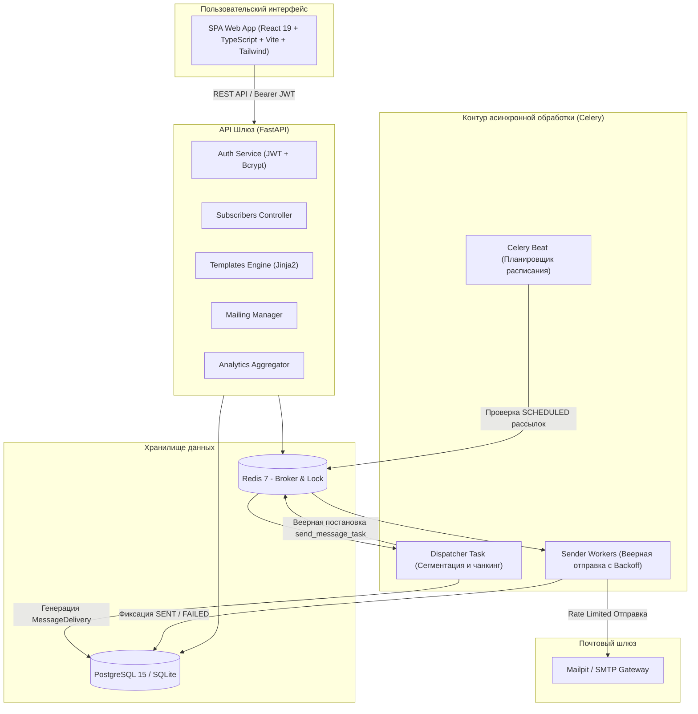
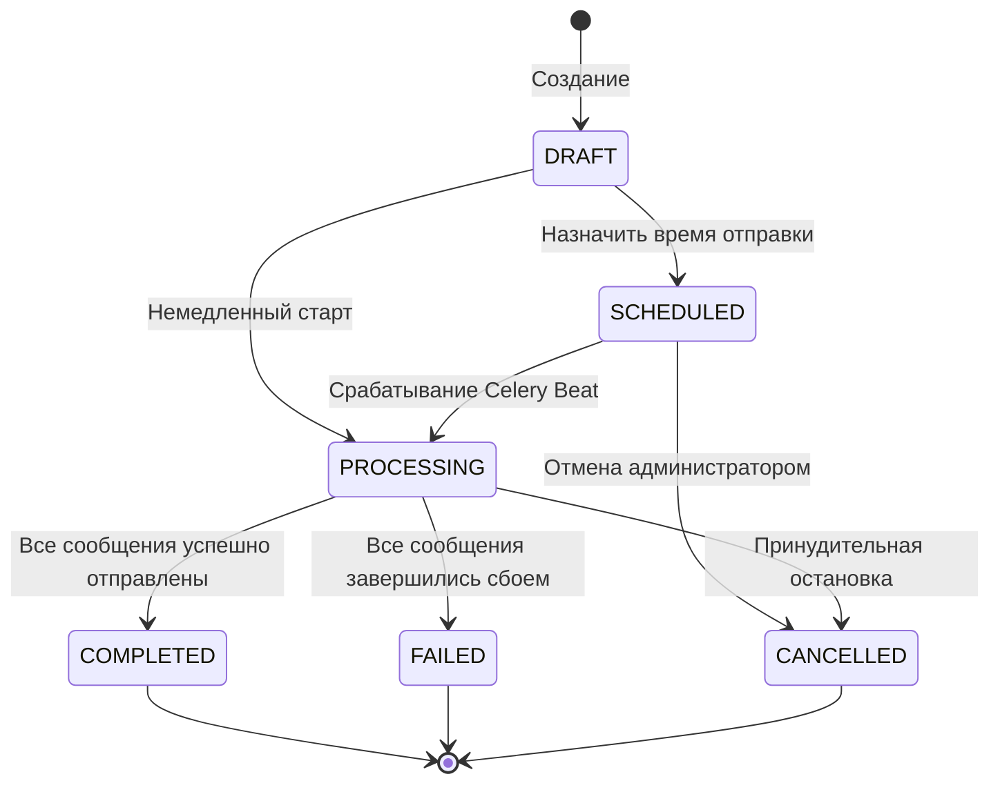
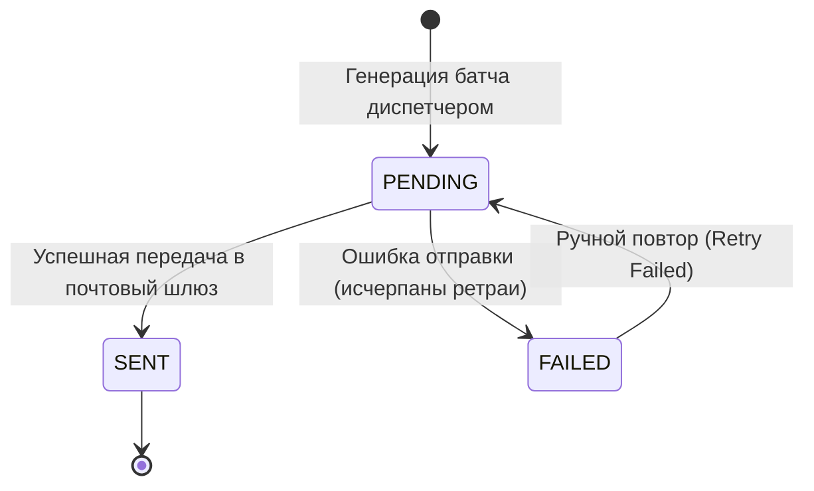

# Архитектура системы управления информационными рассылками

## 1. Обзор архитектуры

Система спроектирована по модульной асинхронной событийно-ориентированной модели (**Event-Driven / Worker Pattern**). Она исключает блокировку пользовательских HTTP-запросов и обеспечивает 100% отказоустойчивость при задержках или сбоях внешних почтовых шлюзов.

---

## 2. Ключевые компоненты

### 2.1. Контур управления (API & Frontend)
- **FastAPI Core (`backend/app/main.py`):** Асинхронный фреймворк, обеспечивающий время ответа API $< 50$ мс. Автоматически генерирует интерактивную OpenAPI-документацию Swagger по адресу `/docs`.
- **Авторизация и безопасность (`backend/app/core/security.py`):** Хеширование паролей алгоритмом `Bcrypt`, сессии на `JWT (HS256)`. Персональные токены отписки генерируются с цифровой подписью для защиты от подделки.
- **Frontend SPA (`frontend/`):** Интерфейс на React 19, TypeScript, Tailwind CSS и Lucide Icons. Реализует 4-шаговый мастер создания кампании, интерактивный предпросмотр шаблонов, динамический фильтр по тегам, импорт CSV и real-time мониторинг выполнения.

### 2.2. Контур данных и предметная область
- **`User` (`backend/app/db/models/user.py`):** Администраторы и подписчики. Поддерживает массив тегов (сегментов) и статус активности (Opt-in).
- **`MessageTemplate` (`backend/app/db/models/template.py`):** Макеты писем на базе Jinja2 с автоматическим извлечением переменных (`{{ user.full_name }}`, `{{ unsubscribe_url }}`) и валидацией синтаксиса до сохранения.
- **`Mailing` (`backend/app/db/models/mailing.py`):** Агрегат рассылки. Хранит фильтр аудитории, расписание запуска, статус и агрегированные счетчики (`total_count`, `success_count`, `failed_count`).
- **`MessageDelivery` (`backend/app/db/models/delivery.py`):** Атомарная запись о доставке каждому адресату. Ограничение уникальности `UniqueConstraint("mailing_id", "recipient_id")` обеспечивает строгую **идемпотентность**.

### 2.3. Контур асинхронной отправки (Workers & Beat)
- **`Celery Beat`:** Каждые 30 секунд проверяет кампании со статусом `SCHEDULED` и временем `scheduled_at <= NOW()`. При наступлении времени переводит кампанию в `PROCESSING` и ставит задачу диспетчера.
- **`dispatch_mailing_task`:** Выбирает подписчиков согласно фильтру, создает записи `MessageDelivery(status=PENDING)` и веерно запускает атомарные задачи отправки.
- **`send_message_task`:**
  1. Проверяет статус рассылки: если она отменена (`CANCELLED`), прерывает отправку.
  2. Проверяет статус доставки: если письмо уже отправлено (`SENT`), завершает выполнение без дублирования.
  3. Рендерит персонализированный шаблон с ссылкой на отписку.
  4. Отправляет письмо через SMTP-клиент с RFC-заголовками (`List-Unsubscribe`, `Precedence: bulk`).
  5. В случае временных сетевых ошибок (`TransientEmailError`) перезапускается с экспоненциальной задержкой ($2^N \times 10$ сек).
  6. При постоянных ошибках (`PermanentEmailError`) сразу фиксирует статус `FAILED` с текстом ошибки.
  7. При завершении всех писем автоматически финализирует статус рассылки в `COMPLETED`.

---

## 3. Конечные автоматы состояний (State Machines)

### 3.1. Жизненный цикл рассылки (`Mailing.status`)

### 3.2. Жизненный цикл сообщения (`MessageDelivery.status`)

---

## 4. Гарантии надежности и безопасность (Reliability & Compliance)

1. **Идемпотентность:** Защита от двойной отправки на уровне уникального составного индекса в БД и предварительной проверки статуса `delivery.status == SENT` перед отправкой.
2. **Exponential Backoff:** Задержки между повторными попытками: 10с -> 20с -> 40с.
3. **Безопасная отписка (RFC 2369 / RFC 8058):** Каждое письмо содержит заголовки `List-Unsubscribe` и `List-Unsubscribe-Post`, а также подписанную ссылку на отписку в 1 клик.
